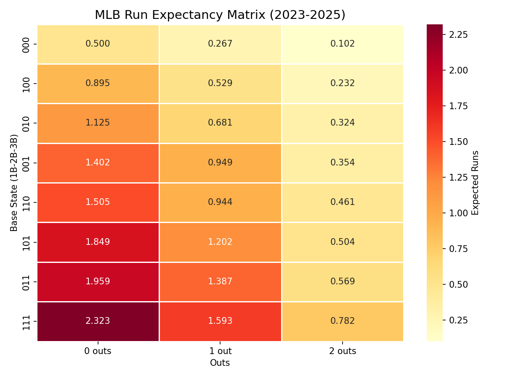
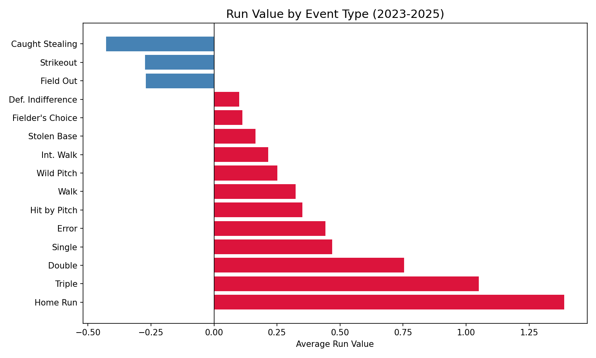
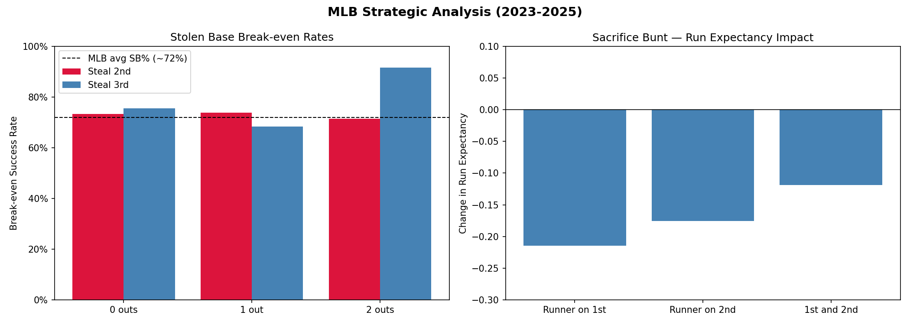

# MLB Run Expectancy Analysis (2023–2025)

A Python sabermetrics project that calculates run expectancy for all 24 base-out states in baseball using three years of MLB play-by-play data.

## What is Run Expectancy?

In baseball, there are 24 distinct game states defined by the number of outs (0, 1, or 2) and which bases are occupied (8 possible configurations). Run expectancy is the average number of runs a team is expected to score from a given state until the end of the inning.

For example:
- Bases empty, 0 outs: 0.500 expected runs
- Bases loaded, 0 outs: 2.323 expected runs
- Bases empty, 2 outs: 0.102 expected runs

This matrix is a foundational tool in modern baseball analytics, used to evaluate player performance, measure the value of strategic decisions, and inform in-game management.

## Key Findings

### Run Expectancy Matrix
The full 24-cell matrix built from 568,000+ plays across the 2023, 2024, and 2025 MLB seasons.



### Run Value by Event Type
Each event type has a measurable impact on run expectancy. Key results:

| Event | Run Value |
|-------|-----------|
| Home Run | +1.389 |
| Triple | +1.051 |
| Double | +0.754 |
| Single | +0.469 |
| Walk | +0.324 |
| Strikeout | -0.273 |
| Caught Stealing | -0.428 |



### Strategic Analysis

**Stolen Base Break-even Rates**

A stolen base attempt is only worth it if the runner succeeds often enough to offset the cost of getting caught. Using the run expectancy matrix, we can calculate the exact break-even success rate:

- Stealing 2nd requires roughly 73% success rate regardless of outs
- Stealing 3rd with 1 out only requires 68%, making it the easiest steal to justify
- Stealing 3rd with 2 outs requires 92%, making it almost never worth attempting

**Sacrifice Bunt**

The data confirms what modern analytics has long argued: the sacrifice bunt consistently hurts the offense across all common situations.

| Situation | RE Before | RE After | Change |
|-----------|-----------|----------|--------|
| Runner on 1st, 0 outs | 0.895 | 0.681 | -0.214 |
| Runner on 2nd, 0 outs | 1.125 | 0.949 | -0.175 |
| Runners on 1st and 2nd, 0 outs | 1.505 | 1.387 | -0.119 |



## Data

Play-by-play data from [Retrosheet](https://www.retrosheet.org/) (2023–2025 regular seasons), parsed using [Chadwick](https://github.com/chadwickbureau/chadwick).

> The information used here was obtained free of charge from and is copyrighted by Retrosheet. Interested parties may contact Retrosheet at www.retrosheet.org.

## Setup and Usage

**Requirements**
- Python 3.12+
- WSL (Ubuntu) recommended on Windows
- Chadwick for parsing Retrosheet data

**Install dependencies**
```bash
python3 -m venv venv
source venv/bin/activate
pip install pandas numpy matplotlib seaborn
```

**Parse Retrosheet data**

Download event files from retrosheet.org/game.htm and run:
```bash
cd data/raw
for year in 2023 2024 2025; do
    for f in ${year}*.EV*; do
        cwevent -y $year -f 0-96 -x 0-63 -q "$f" >> ../parsed/events_extended.csv
    done
done
```

**Run the analysis**
```bash
python run_expectancy.py
```

## Project Structure

```
baseball_project/
├── data/
│   ├── raw/          ← Retrosheet .EVA/.EVN event files
│   └── parsed/       ← Parsed CSV output from Chadwick
├── notebooks/
│   ├── run_expectancy.ipynb
│   ├── run_expectancy_matrix.png
│   ├── run_values.png
│   └── strategic_analysis.png
├── run_expectancy.py
└── README.md
```

## Tools and Libraries

- Python: pandas, numpy, matplotlib, seaborn
- Retrosheet: play-by-play data
- Chadwick: Retrosheet event file parser
- Jupyter Notebook: exploratory analysis
